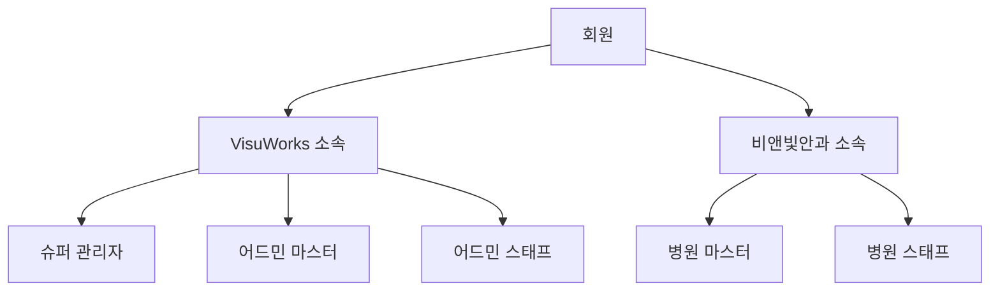
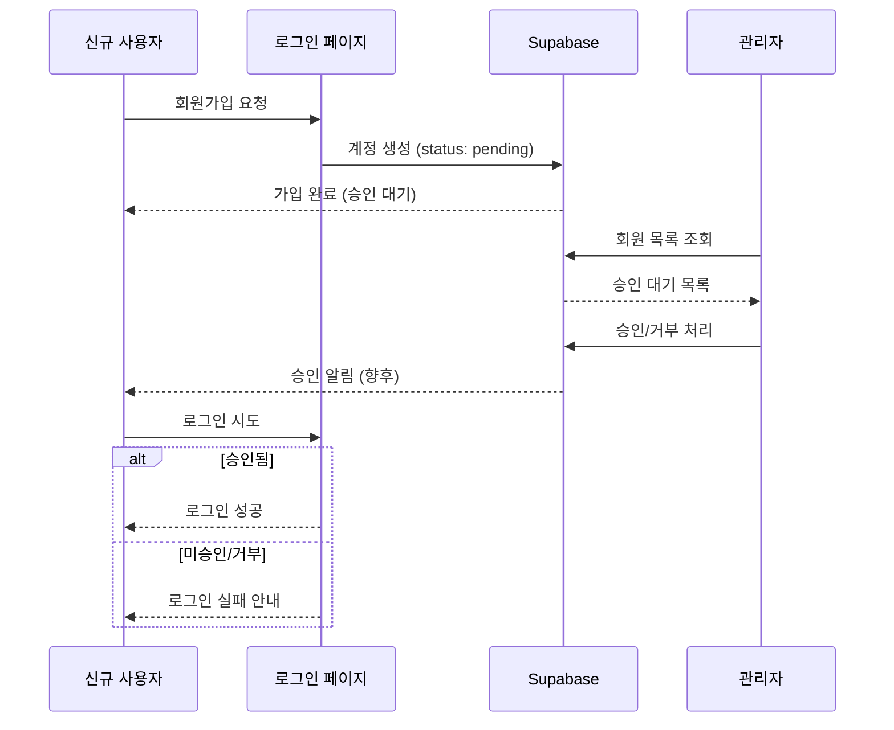

# 회원 관리 화면 기획서

> 작성일: 2026-01-10  
> 버전: v1.0  
> 상태: 초안

---

## 1. 개요

### 1.1 목적

- 시스템 사용자 계정 관리 (가입/승인/거부/수정)
- VisuWorks 및 비앤빛안과 소속 회원 통합 관리
- 권한별 접근 제어

### 1.2 접근 권한

| 권한 | 회원 조회 | 회원 승인 | 회원 수정 | 권한 변경 |
|------|----------|----------|----------|----------|
| 슈퍼 관리자 | ✅ 전체 | ✅ | ✅ | ✅ |
| 어드민 마스터 | ✅ 전체 | ✅ | ✅ | ❌ |
| 어드민 스태프 | ✅ 전체 | ❌ | ❌ | ❌ |
| 병원 마스터 | ✅ 소속만 | ✅ 소속만 | ✅ 소속만 | ❌ |
| 병원 스태프 | ❌ | ❌ | ❌ | ❌ |

---

## 2. 화면 구조

### 2.1 탭 구성

```
[ 전체 ] [ VisuWorks ] [ 비앤빛안과 ] [ 승인 대기 ]
```

| 탭 | 설명 | 필터 조건 |
|----|------|----------|
| 전체 | 모든 회원 표시 | 없음 |
| VisuWorks | 비쥬웍스 소속 회원 | hospital_code = 'visuworks2024' |
| 비앤빛안과 | 비앤빛안과 소속 회원 | hospital_code = 'bnviit1994' |
| 승인 대기 | 승인 대기 중인 회원 | status = 'pending' |

### 2.2 통계 카드

```
┌─────────────┬─────────────┬─────────────┬─────────────┬─────────────┐
│  📊 전체     │  ⏳ 승인대기  │  ✅ 승인완료  │  ❌ 거부됨   │  🏥 병원소속  │
│     12      │      3      │      8      │      1      │      5      │
└─────────────┴─────────────┴─────────────┴─────────────┴─────────────┘
```

### 2.3 테이블 컬럼

| # | 컬럼명 | 설명 | 정렬 |
|---|--------|------|------|
| 1 | No | 순번 | - |
| 2 | 이름 | 회원 이름 | ✅ |
| 3 | 아이디(이메일) | 로그인 이메일 | ✅ |
| 4 | 전화번호 | 연락처 | - |
| 5 | 부서 | 소속 부서 | ✅ |
| 6 | 직위 | 직함 | ✅ |
| 7 | 권한 | 시스템 권한 등급 | ✅ |
| 8 | 소속 | VisuWorks/비앤빛안과 | ✅ |
| 9 | 상태 | 승인대기/승인됨/거부됨 | ✅ |
| 10 | 등록일 | 가입일 | ✅ |
| 11 | 관리 | 수정 버튼 | - |

---

## 3. 회원 유형

### 3.1 소속별 분류



### 3.2 권한별 역할

| 권한 | 소속 | 역할 설명 |
|------|------|----------|
| 슈퍼 관리자 | VisuWorks | 시스템 전체 관리, 모든 권한 |
| 어드민 마스터 | VisuWorks | 본사 관리자, 병원 관리 가능 |
| 어드민 스태프 | VisuWorks | 본사 직원, 조회 권한 |
| 병원 마스터 | 비앤빛안과 | 병원 원장/관리자, 소속 병원 관리 |
| 병원 스태프 | 비앤빛안과 | 병원 직원, 기본 사용 권한 |

---

## 4. 회원 가입 프로세스

### 4.1 가입 → 승인 플로우



### 4.2 상태 전이

```
[가입] → pending(승인대기) → approved(승인됨)
                          → rejected(거부됨) → pending(재신청)
```

---

## 5. 회원 정보 수정 모달

### 5.1 레이아웃

```
┌─────────────────────────────────────────┐
│  회원 정보 수정                    [X] │
├─────────────────────────────────────────┤
│                                         │
│  현재 상태: ● 승인됨                    │
│                                         │
│  ┌─────────────┐  ┌─────────────────┐  │
│  │ 이름        │  │ 이메일 (읽기전용) │  │
│  │ 김승욱      │  │ user@email.com  │  │
│  └─────────────┘  └─────────────────┘  │
│                                         │
│  ┌─────────────┐  ┌─────────────────┐  │
│  │ 권한        │  │ 소속            │  │
│  │ [선택 v]    │  │ [선택 v]        │  │
│  └─────────────┘  └─────────────────┘  │
│                                         │
│  ┌─────────────────────────────────┐   │
│  │ 연락처                          │   │
│  │ 010-1234-5678                   │   │
│  └─────────────────────────────────┘   │
│                                         │
│  ┌─────────────┐  ┌─────────────────┐  │
│  │ 부서        │  │ 직위            │  │
│  │ [선택 v]    │  │ [선택 v]        │  │
│  └─────────────┘  └─────────────────┘  │
│                                         │
├─────────────────────────────────────────┤
│ [✓ 승인] [✗ 거부]          [취소] [저장] │
└─────────────────────────────────────────┘
```

### 5.2 수정 가능 필드

| 필드 | 수정 가능 | 비고 |
|------|----------|------|
| 이름 | ✅ | - |
| 이메일 | ❌ | 로그인 ID (변경 불가) |
| 권한 | ✅ | 슈퍼 관리자만 변경 가능 |
| 소속 | ✅ | - |
| 연락처 | ✅ | - |
| 부서 | ✅ | - |
| 직위 | ✅ | - |
| 상태 | ✅ | 승인/거부 버튼 |

---

## 6. 부서/직위 옵션

### 6.1 부서 목록

**VisuWorks**

- DX팀
- 연구개발팀
- 경영기획팀
- 마케팅팀
- 콘텐츠팀
- CQO팀

**비앤빛안과**

- 전산정보팀
- 진료팀
- 원무팀
- 간호팀
- 수술팀
- 마케팅팀

### 6.2 직위 목록 (소속별 분기)

**VisuWorks**

- 디렉터
- 리드
- 매니저
- 어쏘

**비앤빛안과**

- 대표
- 이사
- 부장
- 차장
- 과장
- 대리
- 사원

> ⚠️ **UI 구현 참고**: 소속 선택 시 해당 소속에 맞는 직위 옵션만 표시

---

## 7. 검색 및 필터

### 7.1 검색

- 이름 검색
- 이메일 검색

### 7.2 필터

- 상태: 전체 / 승인대기 / 승인됨 / 거부됨
- 소속: 전체 / VisuWorks / 비앤빛안과
- 권한: 전체 / 각 권한별

---

## 8. 구현 체크리스트

### 8.1 백엔드 (Supabase)

- [x] profiles 테이블 설계
- [x] hospitals 테이블 연동
- [x] RLS 정책 설정
- [ ] VisuWorks 조직 추가

### 8.2 프론트엔드

- [x] 회원 목록 테이블
- [x] 통계 카드
- [x] 수정 모달
- [ ] 탭 구성 (소속별 필터)
- [ ] 부서 옵션 동적 로딩 (소속에 따라)
- [x] 이름 필드 편집 기능

### 8.3 권한 체크

- [ ] 권한별 버튼 표시/숨김
- [ ] 슈퍼 관리자만 권한 변경 가능
- [ ] 병원 마스터는 소속 병원만 관리

---

## 9. 향후 개선사항

1. **알림 기능**: 승인/거부 시 이메일 알림
2. **일괄 처리**: 여러 회원 동시 승인/거부
3. **엑셀 내보내기**: 회원 목록 다운로드
4. **비밀번호 초기화**: 관리자가 비밀번호 재설정 링크 발송
5. **로그인 이력**: 회원별 접속 로그 조회

---

## 변경 이력

| 버전 | 날짜 | 변경 내용 | 작성자 |
|------|------|----------|--------|
| v1.0 | 2026-01-10 | 초안 작성 | - |
