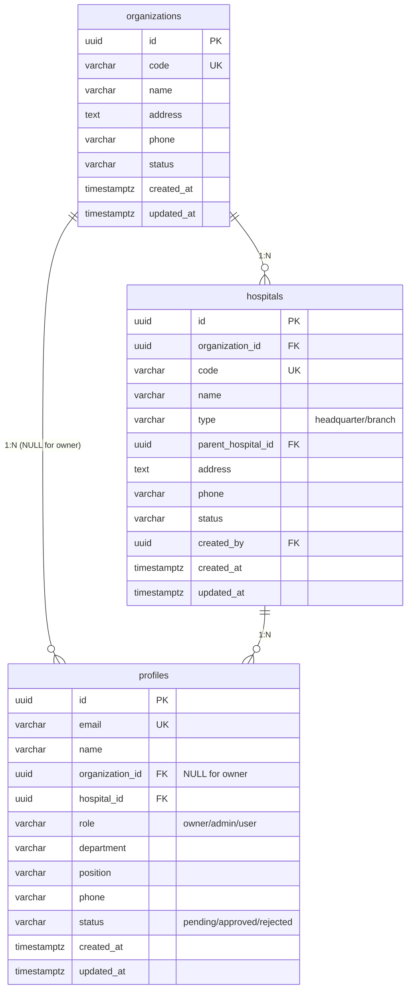

# EyeChartPro 데이터베이스 & 서비스 아키텍처

> 작성일: 2026-01-10  
> 버전: v2.0  
> 상태: 확정

---

## 1. 서비스 구조

### 1.1 개요

```
┌─────────────────────────────────────────────────────────────┐
│                    EyeChartPro Platform                      │
│                   (VisuWorks가 개발/운영)                     │
├─────────────────────────────────────────────────────────────┤
│                                                              │
│   ┌──────────────┐         ┌──────────────────────────────┐ │
│   │ 시스템 관리자 │         │          고객사 (Tenants)      │ │
│   │  (VisuWorks) │         │                               │ │
│   │              │         │  ┌───────────────────────┐   │ │
│   │  • owner     │         │  │ 고객사 A: 비앤빛안과    │   │ │
│   │  • 전체 접근  │         │  │  ├─ 본원              │   │ │
│   │              │         │  │  ├─ 강서점            │   │ │
│   └──────────────┘         │  │  └─ 강동점            │   │ │
│                            │  └───────────────────────┘   │ │
│                            │                               │ │
│                            │  ┌───────────────────────┐   │ │
│                            │  │ 고객사 B: (미래 고객)   │   │ │
│                            │  │  └─ 병원들...         │   │ │
│                            │  └───────────────────────┘   │ │
│                            └──────────────────────────────┘ │
└─────────────────────────────────────────────────────────────┘
```

### 1.2 핵심 개념

| 개념 | 설명 | DB 테이블 |
|------|------|----------|
| **EyeChartPro** | 플랫폼 자체 (SaaS) | - |
| **VisuWorks** | 플랫폼 개발/운영사 | profiles (role=owner) |
| **고객사 (Organization)** | 서비스를 구독하는 회사 | organizations |
| **병원 (Hospital)** | 고객사가 운영하는 병원 | hospitals |
| **사용자 (User)** | 시스템 사용자 | profiles |

---

## 2. 사용자 권한 체계

### 2.1 역할 정의

| 역할 | 코드 | 소속 | 범위 | 설명 |
|------|------|------|------|------|
| **시스템 관리자** | `owner` | organization_id = NULL | 전체 시스템 | VisuWorks 직원, 모든 고객사 관리 |
| **고객사 관리자** | `admin` | organization_id = 고객사 | 소속 고객사 | 고객사 내 병원/회원 관리 |
| **일반 사용자** | `user` | organization_id = 고객사 | 소속 고객사 | 기본 기능 사용 |

### 2.2 권한 매트릭스

| 기능 | owner | admin | user |
|------|-------|-------|------|
| 고객사(Organization) 추가/삭제 | ✅ | ❌ | ❌ |
| 병원 추가/수정 | ✅ 전체 | ✅ 소속만 | ❌ |
| 회원 승인/거부 | ✅ 전체 | ✅ 소속만 | ❌ |
| 권한 변경 | ✅ | ❌ | ❌ |
| 데이터 조회 | ✅ 전체 | ✅ 소속만 | ✅ 소속만 |
| 시스템 설정 | ✅ | ❌ | ❌ |
| 구독/결제 관리 | ✅ 전체 | ✅ 소속만 | ❌ |

---

## 3. 데이터베이스 스키마

### 3.1 ERD 다이어그램



### 3.2 테이블 상세

#### organizations (고객사)

| 컬럼 | 타입 | 제약 | 설명 |
|------|------|------|------|
| id | UUID | PK | 고유 식별자 |
| code | VARCHAR(20) | UNIQUE, NOT NULL | 고객사 코드 |
| name | VARCHAR(100) | NOT NULL | 고객사명 |
| address | TEXT | | 주소 |
| phone | VARCHAR(20) | | 연락처 |
| status | VARCHAR(20) | DEFAULT 'active' | active/inactive |
| created_at | TIMESTAMPTZ | DEFAULT now() | 생성일 |
| updated_at | TIMESTAMPTZ | DEFAULT now() | 수정일 |

#### hospitals (병원)

| 컬럼 | 타입 | 제약 | 설명 |
|------|------|------|------|
| id | UUID | PK | 고유 식별자 |
| organization_id | UUID | FK | 소속 고객사 |
| code | VARCHAR(20) | UNIQUE, NOT NULL | 병원 코드 |
| name | VARCHAR(100) | NOT NULL | 병원명 |
| type | VARCHAR(20) | NOT NULL | headquarter/branch |
| parent_hospital_id | UUID | FK | 상위 병원 (분원용) |
| address | TEXT | | 주소 |
| phone | VARCHAR(20) | | 연락처 |
| status | VARCHAR(20) | DEFAULT 'active' | active/inactive |
| created_by | UUID | FK | 등록자 |
| created_at | TIMESTAMPTZ | DEFAULT now() | 생성일 |
| updated_at | TIMESTAMPTZ | DEFAULT now() | 수정일 |

#### profiles (사용자)

| 컬럼 | 타입 | 제약 | 설명 |
|------|------|------|------|
| id | UUID | PK | auth.users.id와 동일 |
| email | VARCHAR(255) | UNIQUE, NOT NULL | 아이디 (이메일) |
| name | VARCHAR(100) | NOT NULL | 이름 |
| organization_id | UUID | FK, **NULLABLE** | 소속 고객사 (owner는 NULL) |
| hospital_id | UUID | FK | 소속 병원 |
| role | VARCHAR(20) | NOT NULL | owner/admin/user |
| department | VARCHAR(50) | | 부서 |
| position | VARCHAR(50) | | 직위 |
| phone | VARCHAR(20) | | 연락처 |
| status | VARCHAR(20) | DEFAULT 'pending' | pending/approved/rejected |
| created_at | TIMESTAMPTZ | DEFAULT now() | 생성일 |
| updated_at | TIMESTAMPTZ | DEFAULT now() | 수정일 |

---

## 4. 현재 데이터 상태

### 4.1 organizations

| code | name | status |
|------|------|--------|
| bnviit1994 | 비앤빛안과 | active |

### 4.2 hospitals

| code | name | type | organization |
|------|------|------|--------------|
| bnviit1994 | 비앤빛안과 | headquarter | 비앤빛안과 |
| bnviit_gangseo | 비앤빛안과 백내장센터(강서점) | branch | 비앤빛안과 |
| bnviit_gangdong | 비앤빛안과 스마일센터(강동점) | branch | 비앤빛안과 |

### 4.3 profiles

| email | name | organization_id | role |
|-------|------|-----------------|------|
| <seungwook.kim@visuworks.co.kr> | 김승욱 | NULL | owner |

---

## 5. 데이터 접근 규칙 (RLS)

### 5.1 핵심 원칙

1. **owner**: 모든 데이터 접근 가능 (organization_id = NULL)
2. **admin/user**: 소속 organization의 데이터만 접근

### 5.2 RLS 정책 예시

```sql
-- hospitals 테이블
CREATE POLICY "owner_full_access" ON hospitals
  FOR ALL TO authenticated
  USING (
    (SELECT role FROM profiles WHERE id = auth.uid()) = 'owner'
  );

CREATE POLICY "org_members_access" ON hospitals
  FOR SELECT TO authenticated
  USING (
    organization_id = (SELECT organization_id FROM profiles WHERE id = auth.uid())
  );
```

---

## 6. 향후 확장 (SaaS)

### 6.1 추가 예정 테이블

- `subscriptions`: 고객사 구독 정보
- `invoices`: 청구서
- `payments`: 결제 내역

### 6.2 organizations 확장 필드

```sql
ALTER TABLE organizations ADD COLUMN plan VARCHAR(20) DEFAULT 'free';
ALTER TABLE organizations ADD COLUMN max_hospitals INTEGER DEFAULT 1;
ALTER TABLE organizations ADD COLUMN max_users INTEGER DEFAULT 3;
```

---

## 변경 이력

| 버전 | 날짜 | 변경 내용 |
|------|------|----------|
| v1.0 | 2026-01-10 | 초안 작성 |
| v2.0 | 2026-01-10 | VisuWorks 분리, owner/admin/user 권한 체계 확정 |
